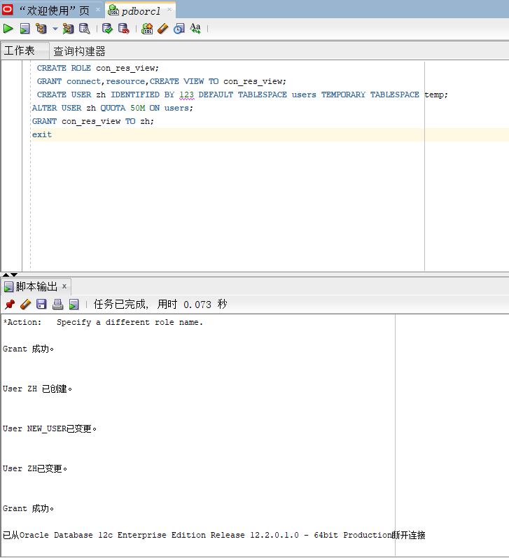
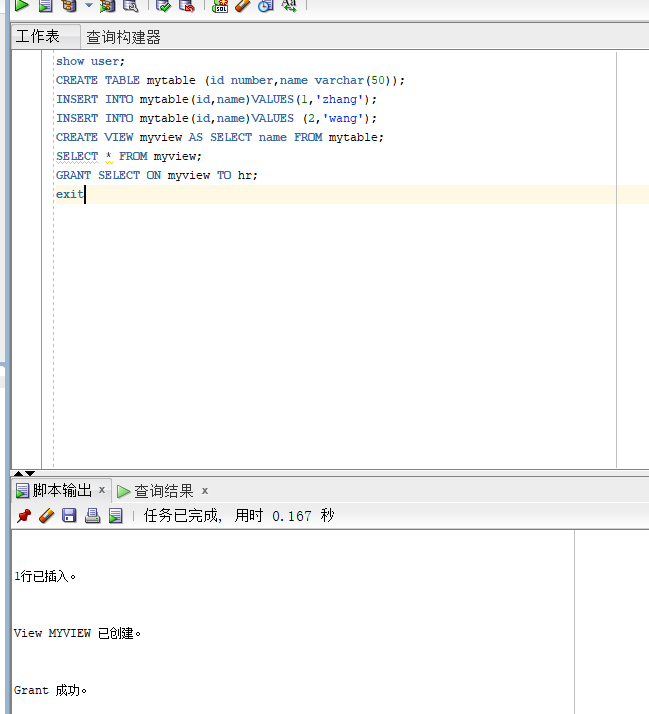
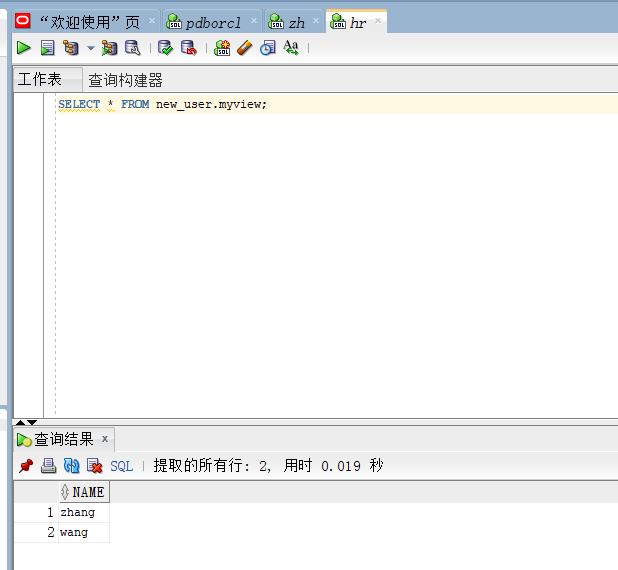
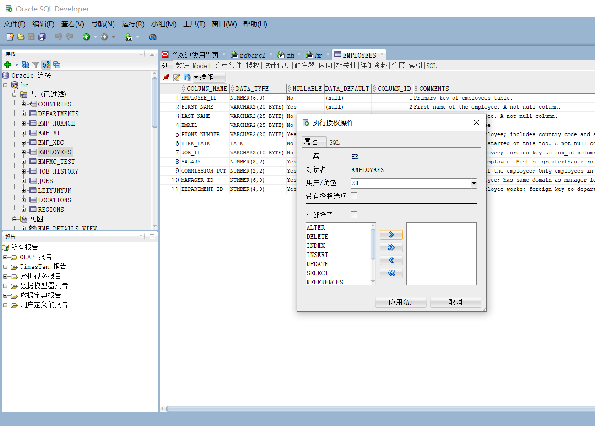

# oracle

### 姓名：赵辉

### 学号：201810414229	

### 班级：18软工2班

### 实验目的：

掌握用户管理、角色管理、权根维护与分配的能力，掌握用户之间共享对象的操作技能。

### 实验内容:

Oracle有一个开发者角色resource，可以创建表、过程、触发器等对象，但是不能创建视图。本训练要求：

- 在pdborcl插接式数据中创建一个新的本地角色con_res_view，该角色包含connect和resource角色，同时也包含CREATE VIEW权限，这样任何拥有con_res_view的用户就同时拥有这三种权限。

  

- 创建角色之后，再创建用户new_user，给用户分配表空间，设置限额为50M，授予con_res_view角色。

- 最后测试：用新用户new_user连接数据库、创建表，插入数据，创建视图，查询表和视图的数据。

### 实验步骤：

- 第1步：以system登录到pdborcl，创建角色con_res_view和用户new_user，并授权和分配空间：

  

  ​			语句“ALTER USER zh QUOTA 50M ON users;”是指授权zh用户访问users表空间，空间限额是50M

- 第2步：新用户zh连接到pdborcl，创建表mytable和视图myview，插入数据，最后将myview的SELECT对象权限授予hr用户。

  

  ​		连接到pdborcl，创建mytable（两列，id与name），往表中添加两行数据，分别是（1，'zhang'）、（2，'wang'），添加视图。

- 第3步：用户hr连接到pdborcl，查询new_user授予它的视图myview

  

  ​	hr连接pdborcl，查询视图

  

  sqldeveloper授权对象的操作界面：

  