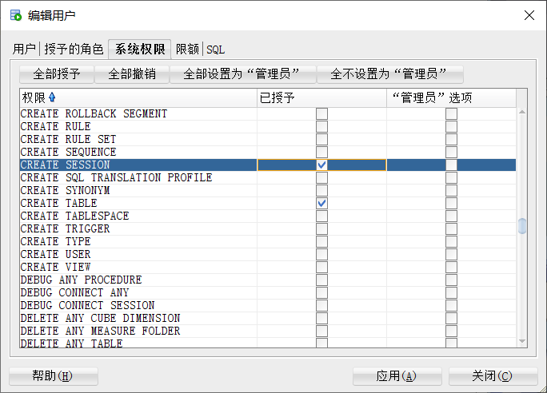
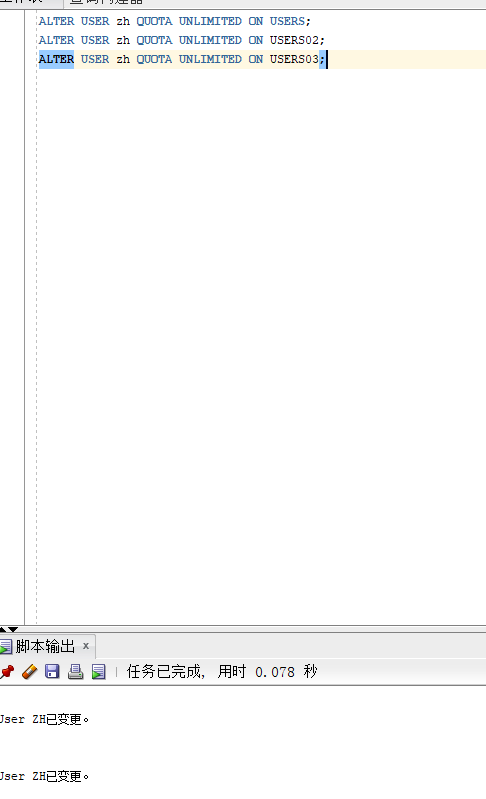
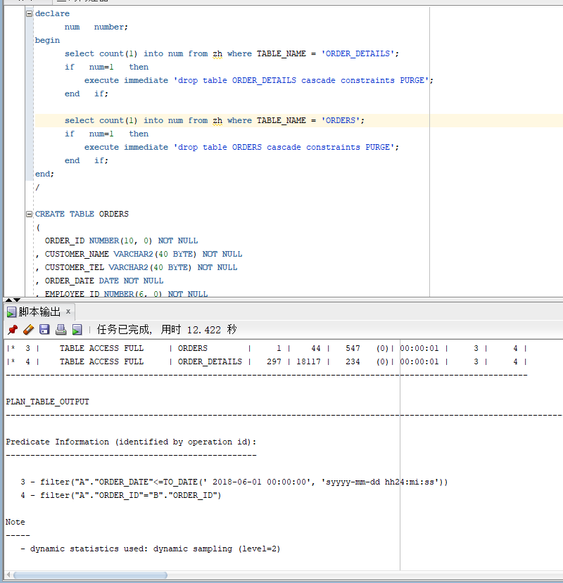
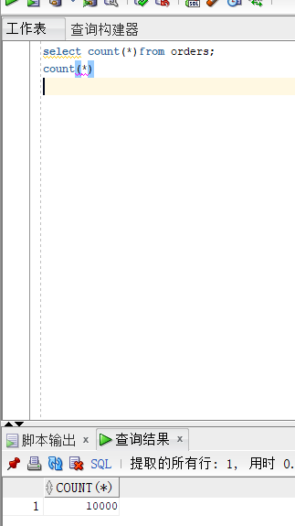
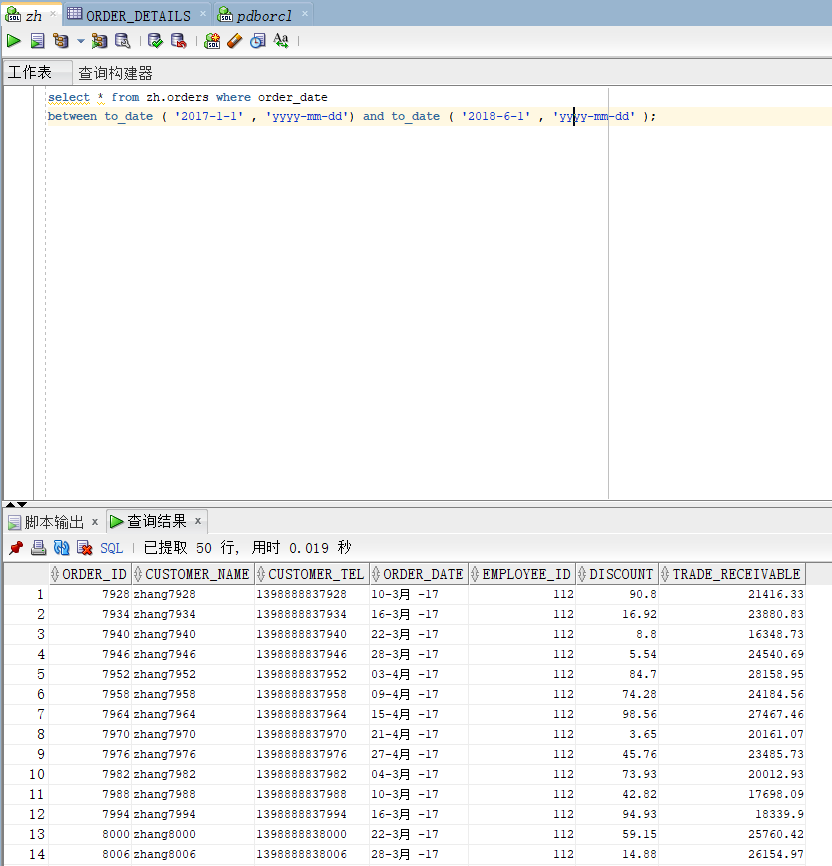
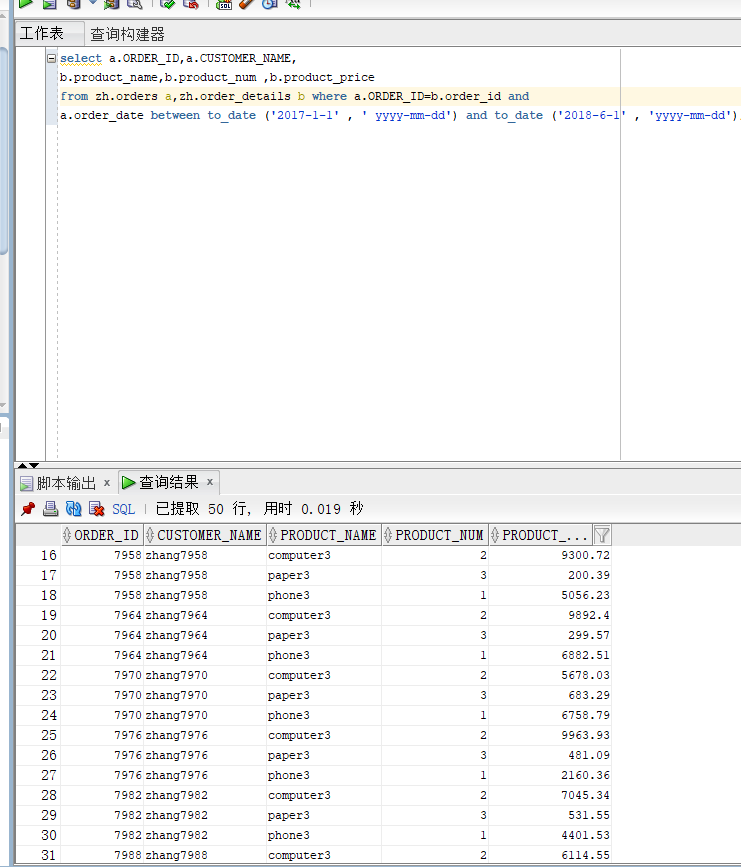
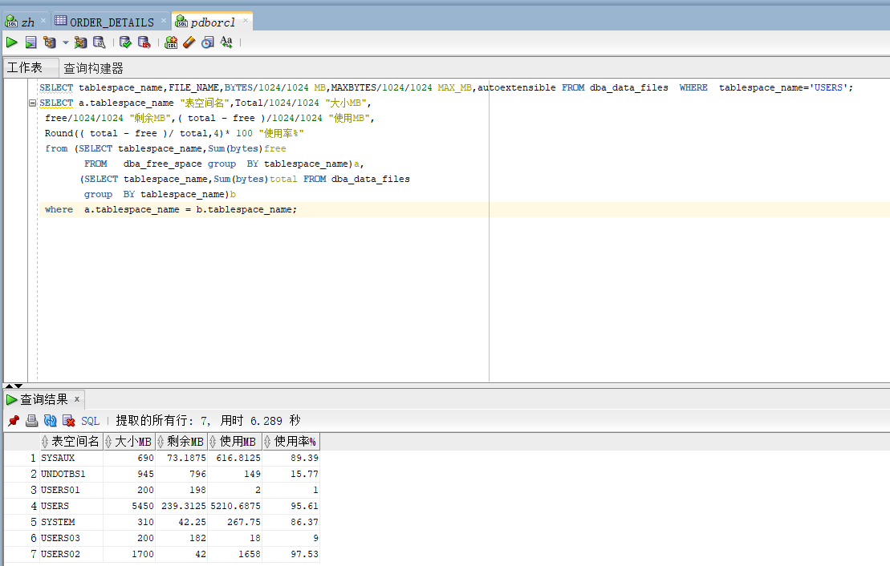

# oracle

### 姓名：赵辉

### 学号：201810414229	

### 班级：18软工2班

### 实验目的：

掌握分区表的创建方法，掌握各种分区方式的使用场景。

### 实验内容：

- 本实验使用3个表空间：USERS,USERS02,USERS03。在表空间中创建两张表：订单表(orders)与订单详表(order_details)。
- 使用你自己的账号创建本实验的表，表创建在上述3个分区，自定义分区策略。
- 你需要使用system用户给你自己的账号分配上述分区的使用权限。你需要使用system用户给你的用户分配可以查询执行计划的权限。
- 表创建成功后，插入数据，数据能并平均分布到各个分区。每个表的数据都应该大于1万行，对表进行联合查询。
- 写出插入数据的语句和查询数据的语句，并分析语句的执行计划。
- 进行分区与不分区的对比实验。

### 实验步骤：

（1）权限授予

（2）创建分区

分别创建了3个分区

（3）在主表orders和从表order_details之间建立引用分区 在study用户中创建两个表：orders（订单表）和order_details（订单详表），两个表通过列order_id建立主外键关联。orders表按范围分区进行存储，order_details使用引用分区进行存储。 

（4）查询数据

orders表中的数据有10000行

（5）查找orders中日期在2017-1-1到2018-6-1间的数据:

（6）ORDER_ID,CUSTOMER_NAME,product_name,product_num,product_price

通过order_id进行联表查询

（7）查看数据库使用情况

### 实验总结：

通过本次实验，学会了如何创建分区，如何在两个表中间创建引用分区。如何进行主外键关联。掌握了各种分区方式的使用场景。

