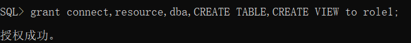

# oracle

### 姓名：赵辉

### 学号：201810414229	

### 班级：18软工2班

### 项目名称：图书管理系统

### 实验目的：期末考核要求

- 自行设计一个信息系统的数据库项目，自拟`某项目`名称。
- 设计项目涉及的表及表空间使用方案。至少5张表和5万条数据，两个表空间。
- 设计权限及用户分配方案。至少两类角色，两个用户。
- 在数据库中建立一个程序包，在包中用PL/SQL语言设计一些存储过程和函数，实现比较复杂的业务逻辑，用模拟数据进行执行计划分析。
- 设计自动备份方案或则手工备份方案。

### 实验内容：

1. 创建数据库

   

2. 创建表空间

   

3. 创建角色

   

4. 给分别给role1，role2分配权限

   

   

5. 创建用户

   

6. 给user1分配role1，user2分配role2

   

7. 使用user1创建对应的表

   

8. 查看创建的表

   

9. 给user1授权修改表空间

   

10. 向表中插入数据

    

11. 在数据库中建立一个程序包，在包中用PL/SQL语言设计一些存储过程和函数，实现比较复杂的业务逻辑，用模拟数据进行执行计划分析

    ```
    create or replace PACKAGE MyPack IS
    	-- 函数
      FUNCTION Get_BookPrice(v_Book NUMBER) RETURN NUMBER;
      	-- 存储过程
      PROCEDURE Get_READERS(V_SEX VARCHAR);
    END MyPack;
    /
    FUNCTION Get_BookPrice(v_Book NUMBER) RETURN NUMBER
      AS
        N NUMBER(20,2);
        BEGIN
          SELECT COUNT(*) into N  FROM BOOK B;
          RETURN N;
        END;
    
    PROCEDURE Get_READERS(V_SEX VARCHAR)
      AS
        LEFTSPACE VARCHAR(2000);
        begin
          for v in
          (SELECT ID,NAME,SEX,PHONE,PHOTO FROM READER WHERE V_SEX = SEX)
          LOOP
            DBMS_OUTPUT.PUT_LINE(NAME);
          END LOOP;
        END;
    END MyPack;
    /
    ```

12. 手动备份

    EXPORT/IMPORT是用来将ORACLE中数据移出/移入数据库。 
    　1、EXPORT将数据库中数据备份成一个二进制系统文件称为“导出转储文件”(EXPORT 
    DUMP FILE)，并将重新生成数据库写入文件中。  
    　　它有三种模式： 
    　　a。用户模式：导出用户所有对象以及对象中的数据； 
    　　b。表模式：导出用户所有表或者指定的表； 
    　　c。整个数据库：导出数据库中所有对象。 
    　　它的备份有三种类型： 
    　　a。完全型(COMPLETE EXPORT)：备份整个数据库； 
    　　b。  积累型(COMULATIVE ERPORT)：备份上一次积累型备份所改变的数据；
    　　c。增量型(INCREAMENTAL EXPORT)：备份上一次备份后改变的数据。

    ​	2、IMPORT导入： 
    　　导入的过程是导出的逆过程，这个命令先读取导出来的导出转储二进制文件，并运行文件
    IMPORT命令执行的方法和EXPORT方案有关。 
    　　1、如果EXPORT所实施的是完全型方案(FULL)则在IMPORT时所有的数据对象，包括表空间
    ，数据文件，用户都会在导入时创建，但考虑到数据库中的物理布局，预先创建表空间和用户
    　　2、如果EXPORT使用的是INCREMENTAL/CUMULATIVE方式，则需要预先设置好表空间、用户

    一.备份命令：

    　　　　1.cmd ： exp

    　　　　2.cmd  ：用户名/密码@ip地址/数据库名  如:   user1/123@192.168.96.1/orcl

    　　　　3.回车：输入要输出的路径  如 D:\orcl.dmp

    二.恢复复制

    　　　　1.cmd  ： imp

    　　　　2.cmd  ：用户名/密码@ip地址/数据库名  如:   user1/123@192.168.96.1/orcl  要

     　　　   3.回车：输入文件的路径  如 D:\orcl.dmp
    
13. 容灾方案

    


